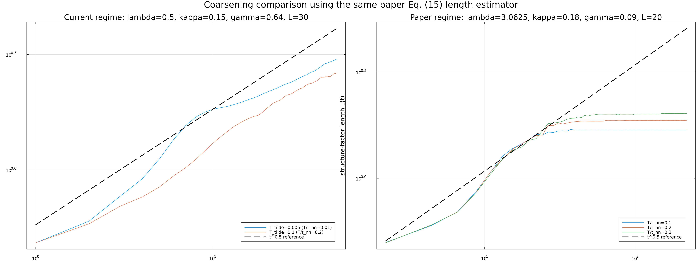

# Adiabatic dynamics

This category contains a dimensionless, two-dimensional semiclassical Holstein
simulation in the adiabatic limit. At every lattice step, the electronic
Hamiltonian is diagonalized and the instantaneous Fermi occupations determine
the electronic force. The classical lattice is evolved with velocity-Verlet
integration and an exact scalar Ornstein-Uhlenbeck thermostat.

There is no associated publication at present. The supplied derivation is kept
as an unpublished research note.

## Structure

- `src/thermal_quench_2d.jl`: simulation source.
- `notes/dimensionless_thermal_quench.pdf`: dimensionless derivation and a
  representative thermal-quench result.
- `figures/two_regime_coarsening_comparison.png`: comparison of moderate- and
  strong-coupling coarsening regimes using the same structure-factor length
  estimator.
- `output/`: default runtime output location; created automatically and ignored
  by Git.

## Default setup

- Square lattice: 30 x 30 sites with periodic boundaries
- Half filling
- 10,000 integration steps and 20 independent runs
- Dimensionless time step: `0.01`
- Electron-phonon coupling: `lambda = 0.5`
- Dimensionless damping: `gamma_tilde = 0.16`
- Initial temperature: `T_init_tilde = 1.0`
- Quench temperature: `T_tilde = 0.005`

The research note illustrates a 20 x 20 calculation, while the supplied code
defaults to 30 x 30. The README records the executable code defaults.

## Run

The program uses only Julia standard libraries:

```bash
julia src/thermal_quench_2d.jl
```

Optionally specify an output root and base random seed:

```bash
julia src/thermal_quench_2d.jl /path/to/output 6081
```

Each run writes initial conditions and `Q`, `P`, and electronic-density
snapshots into its own `run_N/` directory. A `parameters.txt` file records the
configuration used for the full ensemble.

The default 30 x 30 ensemble repeatedly diagonalizes a dense 900 x 900
Hamiltonian and is computationally expensive. Use a smaller `SimulationConfig`
for local checks before launching the production setup.

## Coarsening comparison



The moderate-coupling regime (`lambda = 0.5`, left) continues to develop a
larger structure-factor length over the displayed time window. In the
strong-coupling regime (`lambda = 3.0625`, right), the corresponding length
rapidly approaches a plateau. This pronounced slowdown is consistent with the
cooperative-hopping mechanism emphasized in the quasi-classical Holstein
study: stronger local electron-lattice locking makes defect rearrangement a
collective process and suppresses continued coarsening.

This is a comparison between two parameter regimes, not a controlled sweep of
`lambda` alone: `kappa`, `gamma`, system size, and the displayed temperature
sets also differ. The figure therefore supports a qualitative connection to
cooperative hopping rather than isolating its dependence on a single
parameter.

### Why the semiclassical description is natural at strong coupling

A simple way to assess the semiclassical lattice approximation is to compare
the characteristic coupling-induced distortion,

\[
X_0 = \frac{g}{K},
\]

with the oscillator's zero-point displacement,

\[
\Delta X = \sqrt{\frac{\hbar}{2m\Omega}},
\qquad
\Omega = \sqrt{\frac{K}{m}}.
\]

The semiclassical description becomes increasingly well motivated when

\[
\frac{\Delta X}{X_0} \ll 1.
\]

For fixed lattice mass and stiffness, increasing the electron-phonon coupling
`g` increases `X_0` while leaving `Delta X` unchanged. The lattice distortion
then becomes large compared with its intrinsic quantum fluctuation, making a
classical treatment of the lattice coordinate more appropriate in the
strong-coupling regime. This criterion supports the semiclassical lattice
description; the adiabatic approximation additionally requires the electronic
sector to relax on a timescale short compared with the lattice motion.
